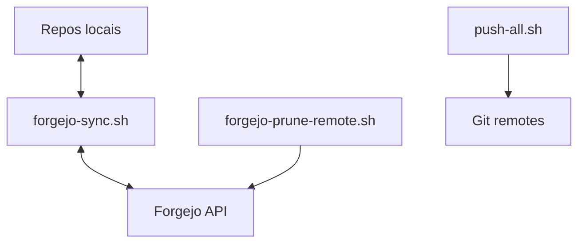

# Scripts

Colecao de scripts operacionais para sincronizacao e manutencao de repositorios Forgejo.

> Estado do projeto: ativo.
> Scripts focados em operacao de multiplos repositorios no workspace local.

---

## Ambiente suportado

Previsto para:

* Linux/macOS shell (bash)
* Git
* Curl
* jq

---

## Requisitos

### Credenciais

* Entrada valida em `~/.git-credentials` para `forgejo.lbtec.org`

### Ferramentas

* `bash`
* `git`
* `curl`
* `jq`

---

## Seguranca

* Revisar scripts de prune antes de apagar remoto.
* Usar `DRY_RUN=1` quando disponivel.
* Validar `WORKSPACE_DIR` antes de execucao.

---

## Instalacao

### 1) Clonar repositorio

```bash
git clone https://forgejo.lbtec.org/lmbalcao/scripts.git
cd scripts
```

---

### 2) Tornar scripts executaveis quando necessario

```bash
chmod +x push push-all.sh aplica-template
```

---

## Configuracao

Variaveis comuns:

* `WORKSPACE_DIR`
* `FORGEJO_HOST`
* `DRY_RUN`
* `REMOTE`

---

## Servicos

| Script | Funcao |
| ------ | ------ |
| `forgejo-sync.sh` | Clona faltantes e cria remotos a partir de `.repository` |
| `forgejo-prune-remote.sh` | Remove remotos sem repositorio local (com confirmacao) |
| `push-all.sh` | Push em lote para repos locais |
| `push` | Mirror/push entre plataformas |
| `aplica-template` | Automatiza aplicacao de template local |

---

## Persistencia

* Nao guarda estado proprio; opera sobre repos locais e APIs remotas.

---

## Arquitetura



---

## Troubleshooting

### Credenciais nao encontradas

Confirmar formato em `~/.git-credentials`.

### jq/curl ausentes

Instalar dependencias do sistema e repetir.

---

## Notas

* Ler o script alvo antes de execucao em producao.
* Alguns scripts podem fazer alteracoes irreversiveis se mal configurados.
